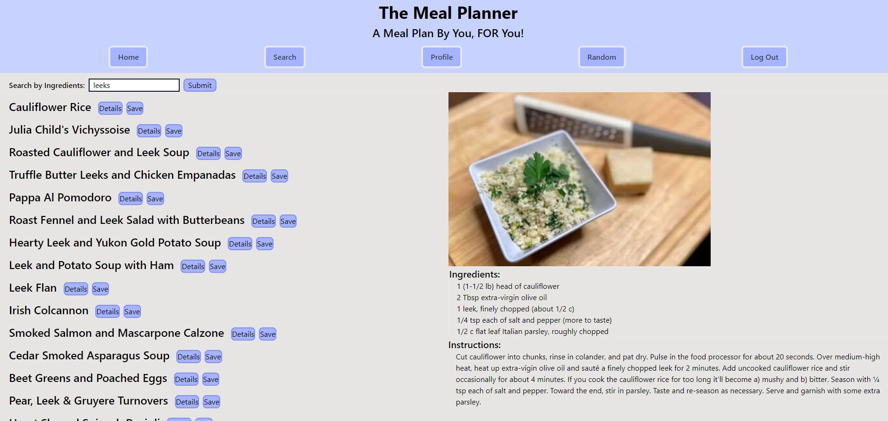

# Meal Planner

## The Meal Planner, a [PDX Code Guild](https://pdxcodeguild.com/) Capstone Project

The Meal Planner is designed as a graduation project for the PDX Code Guild Full Stack Web Developer Bootcamp. It is a recipe finder built for those who just want to input a variety of ingredients, see the results that pop up, and save the information to their profile page for future viewing. Some of the information the user recieves is the **calorie, protein, carbs, and fat** macros per serving. The app utilizes the [Spoonacular API](https://spoonacular.com/food-api/) and was built with Django, Vue.js, and TailwindCSS.

### Check out The Meal Planner [here](https://tardi-meal-planner.herokuapp.com/)




## How to Run Meal Planner Locally

You must first activate a virtual environment, or pip install globally, depending on your preference. 

```
$ pip install -r requirement.txt
$ cd Meal_Planner
$ py manage.py migrate
$ py manage.py runserver
```

Then either click on the "Log In" button at the top to create your account, or follow the "Getting Started" information on the home page and enjoy!
